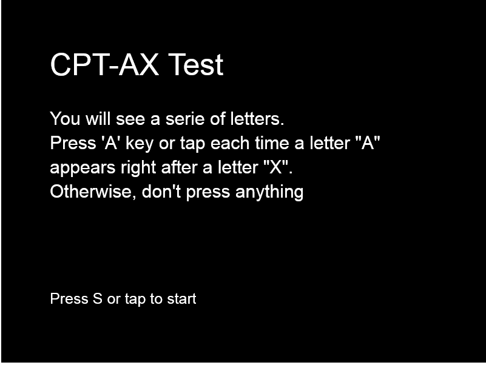

# Embraced Tests
## Description
Psychological tests implemented for Embraced Project to measure the attention of the user over time:

1. Continuos Performance Test-AX 
2. Cancellation Test

## Implementation
Two tests have been implemented using Phaser, a framework for game design in Javascript language.

## Instructions
To execute a test just open the **index.html** file in any browser (Chrome is optimal) . Then an explanation of each test will be shown in the start screen.
## Screenshots

